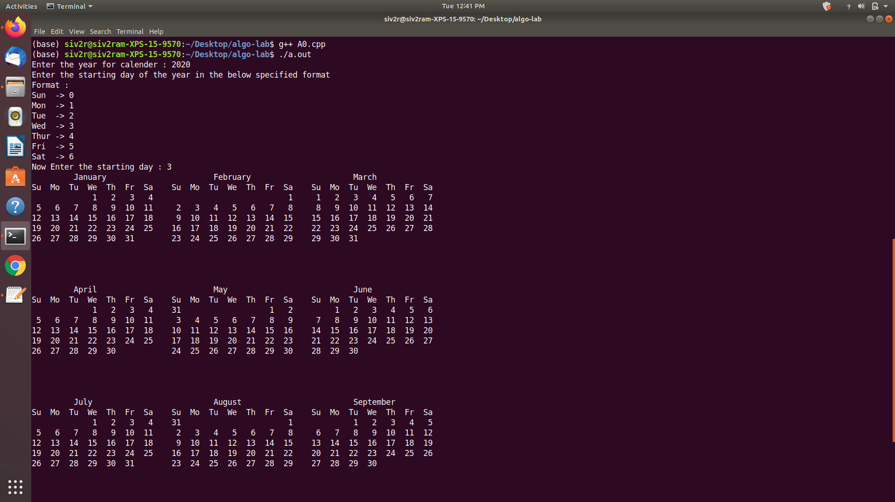
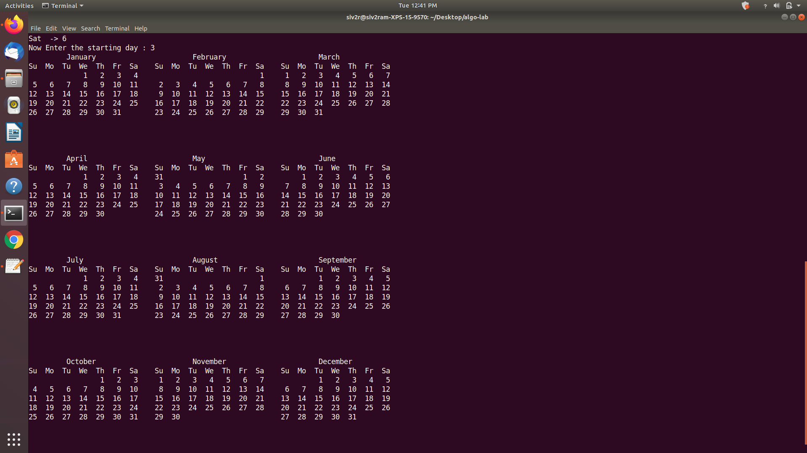

# Gregorian calender printer

A C++ based project to print a Gregorian calender in an ergonomic format.

Sample output after executing the program with **year = 2020** and **starting day of the year = 3 (wednesday)**

**please click** the image to get a better view of its content

